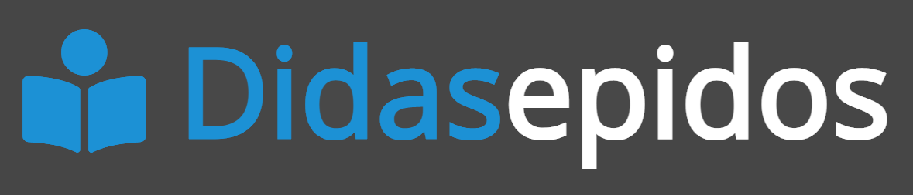

<!-- PROJECT LOGO -->
 

  

  <h3 align="center">didasepidos</h3>

  

    Serviço web para avaliação anônima de instituições de ensino, por disciplina.
     
    (Meu primeiro projeto utilizando a Spring Framework. Feito em 2021, durante a pandemia de COVID-19)
     
     
    <a href="https://www.youtube.com/watch?v=Fe7gD6rr_zE">Video de demonstração</a>
  

<!-- ABOUT THE PROJECT -->
## Sobre o Projeto

    

Durante a pandemia de COVID-19, houve grande insatisfação entre os estudantes do ensino médio quanto às tentativas de adequação ao modelo remoto por escolas públicas e privadas de todo o país. Temendo retaliação, muitos estudantes não comunicavam aos administradores de suas escolas sobre problemas importantes a serem resolvidos.

Este sistema teve como principal objetivo oferecer aos estudantes uma plataforma anônima na qual poderiam avaliar escolas e matérias específicas segundo quaisquer critérios. Além disso, a plataforma contava com um ranking das instituições mais bem avaliadas.

(<a href="#readme-top">back to top</a>)

### Feito com

* 
* 
* 

(<a href="#readme-top">back to top</a>)

